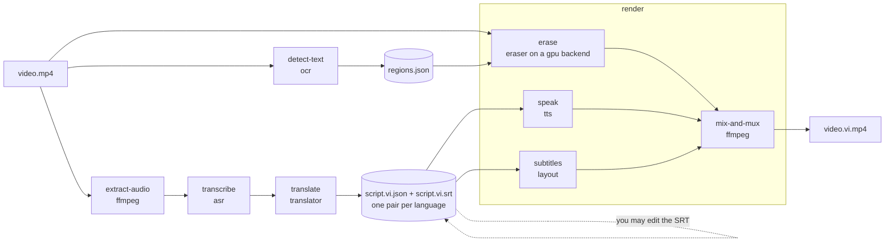

# Architecture

EraseDub is a small **engine** plus a set of **providers**. The engine knows the order of the steps and moves data
between them; each step is done by a provider that the engine only talks to through an abstract base class. Built-in
providers ship with EraseDub; third-party packages can add more without changing EraseDub (see [plugins.md](plugins.md)).

The reasons behind the main design choices (plugins through entry points, the two-step flow, the GPU rule,
licence and secret policies) are recorded as [architecture decision records](adr/README.md).

## Pipeline

A video goes through two phases. `erasedub run` does both in one go; `prepare` and `render` let you stop in between
and edit the script ([ADR 0003](adr/0003-two-step-prepare-render.md)).

| Phase | Step | Provider kind | Default | Runs when |
|---|---|---|---|---|
| prepare | `extract-audio` | — (ffmpeg) | — | always |
| prepare | `transcribe` | `asr` | `whisperx` | always |
| prepare | `detect-text` | `ocr` | `rapidocr` | unless erasing is off (`--no-erase`, `erase.enabled = "off"` or `erase.provider = "none"`) |
| prepare | `translate` | `translator` | `google` | always |
| render | `erase` | `eraser` (on a `gpu` backend) | `sttn` on `local` | see below |
| render | `speak` | `tts` | `edge` | unless `--no-voice` / `tts.enabled = false` |
| render | `subtitles` | `layout` | `bottom` | unless `--no-subs` / `subtitles.enabled = false` |
| render | `mix-and-mux` | — (ffmpeg) | — | always |

In `render`, erasing (GPU work) and speech synthesis (network or CPU work) are independent, so they can run at the
same time; the final mix waits for both.

### The GPU rule

Why: [ADR 0004](adr/0004-no-gpu-means-no-erasing.md).

The plan for a run is built from the configuration and the detected hardware before any media is touched
(`erasedub.pipeline.plan_video`, which calls `build_plan`; also used by `--dry-run`). For the erase step:

| `erase.enabled` | GPU backend | NVIDIA GPU found | Result |
|---|---|---|---|
| `off`, or `erase.provider = "none"` | any | any | not run |
| `auto` (default) or `on` | `local` | yes | run on the local GPU |
| `auto` or `on`, with an eraser that does not need a GPU (`lama`) | `local` | any | run on this machine (CPU or Apple GPU) |
| `auto` or `on` | `modal` (or any non-local backend) | any | run on that backend |
| `auto` | `local` | no | **skipped**, with a notice that suggests `erase.provider = "lama"`; everything else still runs |
| `on` | `local` | no | error (exit code 3): use `--gpu modal`, rent a GPU, or set `auto` (and leave out `--gpu`) |
| `auto`, erasing in `render` | any | any | no `regions.json` in the work folder: **skipped**, with a notice |
| `on`, erasing in `render` | any | any | no `regions.json`: error (exit code 2) |
| `auto` | any | — | GPU backend or eraser not ready (backend `check()` fails; for a local backend also the eraser's `check()`): **skipped**, with a notice |
| `on` | any | — | GPU backend or eraser not ready: error (exit code 3) |

A remote backend (such as `modal`) does not need a local GPU; whether it can run is decided by its own `check()`.
An unknown eraser or backend name is exit code 2.

An explicit `--gpu <backend>` on the command line (without `--no-erase`) sets `erase.enabled = "on"` for that run,
also over `"off"` in the config: asking for a backend means erasing is wanted, so a backend that cannot run is exit
code 3, not a notice. `erase.gpu` set only in the config keeps the configured `enabled` (normally `auto`).
`--no-erase` still turns erasing off. `--gpu` together with `erase.provider = "none"` names no eraser, so it is exit
code 2. The CLI and the web UI both plan through `erasedub.pipeline.plan_video`, so they apply these rules the same
way.

`detect-text` runs on the CPU, so it is skipped only when erasing is off (`erase.enabled = "off"` or
`erase.provider = "none"`), not when erasing would be skipped for lack of a GPU: the regions are then ready if you
later render on a GPU. If the OCR provider is not ready, `auto` continues with a notice (render will then have
nothing to erase) and `on` stops with exit code 3. `prepare` accepts `--gpu` and `--no-erase` as well; use the same
values for `prepare` and `render`.

`--dry-run` builds this plan and also validates it: an unknown provider name exits with code 2, and a provider
needed by an enabled step that cannot run here exits with code 3.

## Data flow and files

- `prepare` writes, into the video's work directory (`work/<video-stem>/`, relative to the current directory),
  one `script.<lang>.json` + `script.<lang>.srt` pair per target language and one shared `regions.json` with the
  on-screen text found by OCR. See [script-format.md](script-format.md).
- `render` reads them back. **The SRT wins** over the JSON, because that is the file people edit. Because the
  regions are saved, `render` does not run OCR again, and a remote GPU backend gets everything it needs from the
  files.
- Data passed between steps uses the models in `erasedub.models`: `Transcript` (segments; word timestamps only when alignment is turned on),
  `TextRegion` (a box on screen plus the time span it is visible), `Voice`, `SynthResult`, `SubtitleEvent`,
  `VideoInfo`. All times are seconds from the start of the video; boxes are pixels of the source video.
- Intermediate files stay in the work directory so a failed render can be re-run without repeating `prepare`.

## Provider kinds

| Kind | Base class | Built-in providers |
|---|---|---|
| `eraser` | `TextEraser` | `sttn` (default), `propainter`, `lama`, `none` ([erasers.md](erasers.md)) |
| `asr` | `Transcriber` | `whisperx` |
| `ocr` | `TextDetector` | `rapidocr` |
| `translator` | `Translator` | `google` (default), `openai`, `gemini`, `claude`, `ollama` |
| `tts` | `SpeechSynthesizer` | `edge` (default), `elevenlabs` |
| `layout` | `SubtitleLayout` | `bottom` |
| `gpu` | `GpuBackend` | `local` (default), `modal` |

Providers are found through Python entry points in the group `erasedub.<kind>` (`erasedub.registry`;
see [ADR 0002](adr/0002-providers-as-entry-point-plugins.md)). EraseDub
registers its own providers the same way a plugin would. `erasedub plugins` lists every registered provider and
whether it can run here (`Provider.check()`: missing Python packages or environment variables). Whether an NVIDIA
GPU is present is reported by the `gpu` backend `local`, not by each provider; the planner uses a provider's
`requires_gpu` flag to decide what can run. Every provider class declares the plugin API version it was written
for, and the registry refuses a mismatch (exit code 3).

A `GpuBackend` decides *where* an eraser runs. It receives an `EraserSpec` (eraser name and options), not an eraser
object: `local` builds the eraser on this machine and runs it on its CUDA device; `modal` uploads the video and
regions, builds the same eraser on [Modal](https://modal.com) with the user's own account, then downloads the clean
video. Only the erase step is sent; nothing else leaves the machine except calls to the online translator and
voice services you choose.

## What is required and what is optional

| Part | Install | Needs |
|---|---|---|
| Engine, CLI, config, script handling, `bottom` layout | core (no extra) | Python 3.11+, ffmpeg with libx264 (and libass to burn subtitles in) |
| Google Translate (free), Edge-TTS | core | internet |
| WhisperX | extra `asr` | PyTorch; GPU recommended |
| RapidOCR | extra `ocr` | CPU is fine |
| STTN eraser (default) | extra `erase` | NVIDIA GPU |
| ProPainter eraser | extra `propainter` | NVIDIA GPU; **non-commercial** licence |
| LaMa eraser | extra `lama` | CPU or Apple GPU (MPS); no NVIDIA GPU needed |
| OpenAI / Gemini / Claude translators | extra `llm` | your API key in an environment variable |
| Ollama translator | extra `ollama` | a running Ollama server |
| ElevenLabs voices | extra `elevenlabs` | your API key |
| Modal GPU backend | extra `modal` | your Modal account and token |
| Web UI | extra `webui` | — |

`full` = `asr`, `ocr`, `erase`, `ollama`, `webui`: everything that runs without paid keys. The optional erasers
(`propainter`, `lama`) are not part of it.

## Design rules

- **One run context.** Every provider call gets a `RunContext` (device, temporary and cache folders, progress,
  cancellation, logger), and providers have `open` / `close` hooks to load and free models.
- **Lazy imports.** Heavy libraries (torch, whisperx, gradio...) are imported inside provider methods, so
  `erasedub --help` is fast and works with only the core install.
- **Keys only from the environment.** The config loader rejects anything that looks like a secret; providers declare
  the environment variables they need and only their presence is checked.
- **`check()` has no side effects.** No downloads, no network calls, no GPU allocation.
- **Stable exit codes.** Every expected error maps to an exit code (see [cli.md](cli.md#exit-codes)).
